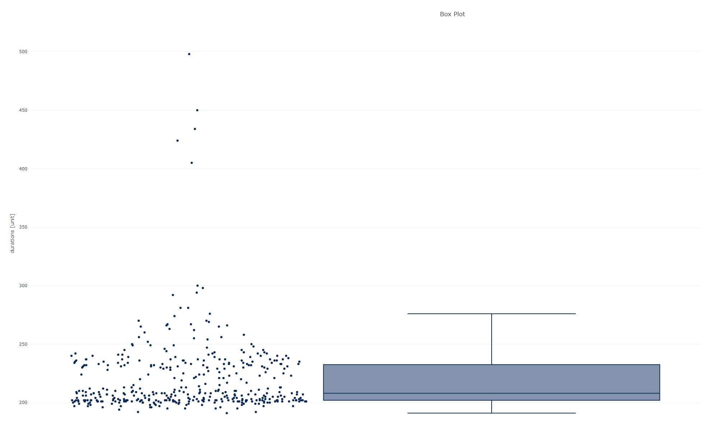

Burl-rs is a statistics-driven benchmarking tool and load generator for http-webapplications, in Rust.

### TODO:
* iteration support for proper benchmarking
* split config
* stats-extension:
    * dump also a table of stats and the raw results into the results folder 
    * confidence interval
    * analyze outliers
    * bivariate metrics for comparison of runs
* reuse connections / persistence, see e.g. https://twitter.com/mlafeldt/status/1437411223948103683 or https://users.rust-lang.org/t/hyper-reqwest-connection-not-being-kept-alive/10895/5
* tokio support 
* -> support jupyter notebooks! via python api
* input randomizer (param to folder with json_payloads)
* functionality for A/B testing / testing different suites
* from json / yaml
* kaleido support? https://github.com/igiagkiozis/plotly#exporting-an-interactive-plot
* wasm support? https://github.com/igiagkiozis/plotly#exporting-an-interactive-plot
* add request_id to request, so that it can be traced back potentially? tbd: could be responsibility of user
* add lib error
