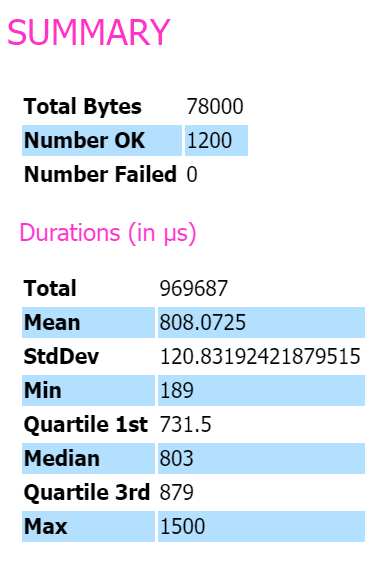
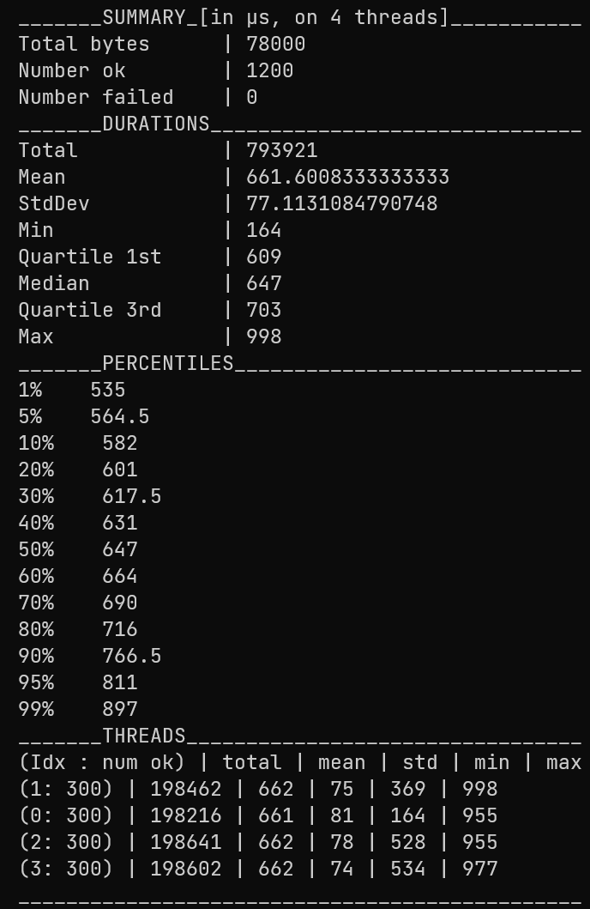
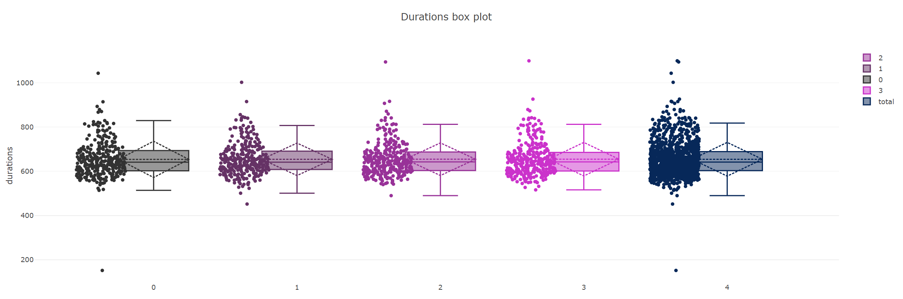
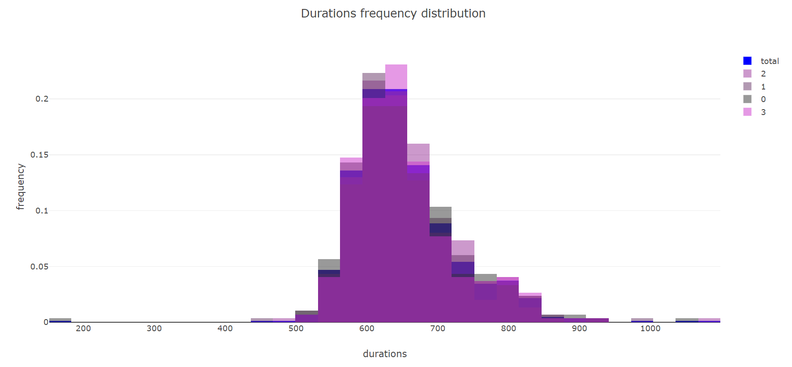
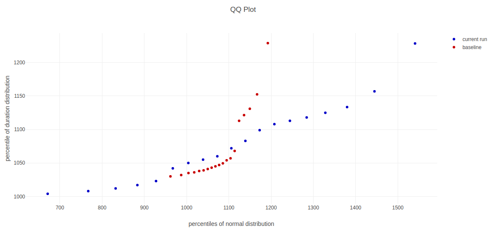
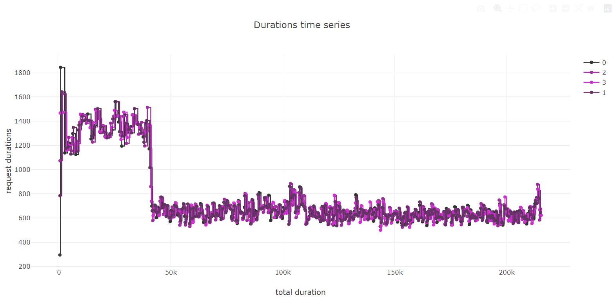

#### Disclaimer

This is work in progress!
 

<b>Burl</b> is a statistics-driven benchmarking tool and load generator for http-webapplications, written in Rust.
Measure KPIs of your endpoints, compare different versions of them and analyze the performance with the provided reports, containing plots and result data.
Run Burl as CLI tool and manage your setup conveniently with config files.

#### Related work

Related to Burl is the HTTP load generator [hey](https://github.com/rakyll/hey). A further source of inspiration was [criterion.rs](https://github.com/bheisler/criterion.rs) which is a statistics-driven microbenchmarking library for your Rust code.

### Examples
Find sample reports for 
* [FastApi (Python)](https://fastapi.tiangolo.com/): 
    - [config](./examples/actix/actix_specs.toml) 
    - [report](./examples/fastapi/report/report.html)
* [Actix web (Rust)](https://github.com/actix/actix-web): 
    - [config](./examples/fastapi/fastapi_specs.toml) 
    - [report](./examples/actix/report/report.html)

 

 
 
 
 

### TODO:
* iteration support for proper benchmarking
* split config
* docs, doctests, manuals,etc
* improve error handling
* cli improvement and clarification
* client builder (pattern)
* stats-extension:
    * reuse (baseline) results for comparison  
    * confidence interval
    * analyze outliers
    * bivariate metrics for comparison of runs
* reuse connections / persistence, see e.g. https://twitter.com/mlafeldt/status/1437411223948103683 or https://users.rust-lang.org/t/hyper-reqwest-connection-not-being-kept-alive/10895/5
* -> support jupyter notebooks! via python api
* support via UI / wasm / etc / run with docker?
* use health endpoints as reference / base
* input randomizer (param to folder with json_payloads)
* functionality for A/B testing / testing different suites
* from json / yaml
* kaleido support? https://github.com/igiagkiozis/plotly#exporting-an-interactive-plot
* wasm support? https://github.com/igiagkiozis/plotly#exporting-an-interactive-plot
* add request_id to request, so that it can be traced back potentially? tbd: could be responsibility of user
* add lib error
* platform builds, incl docker
